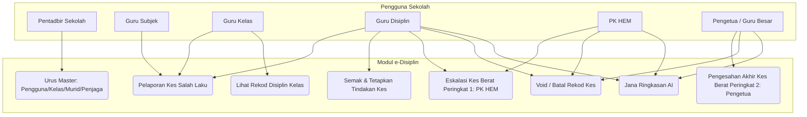
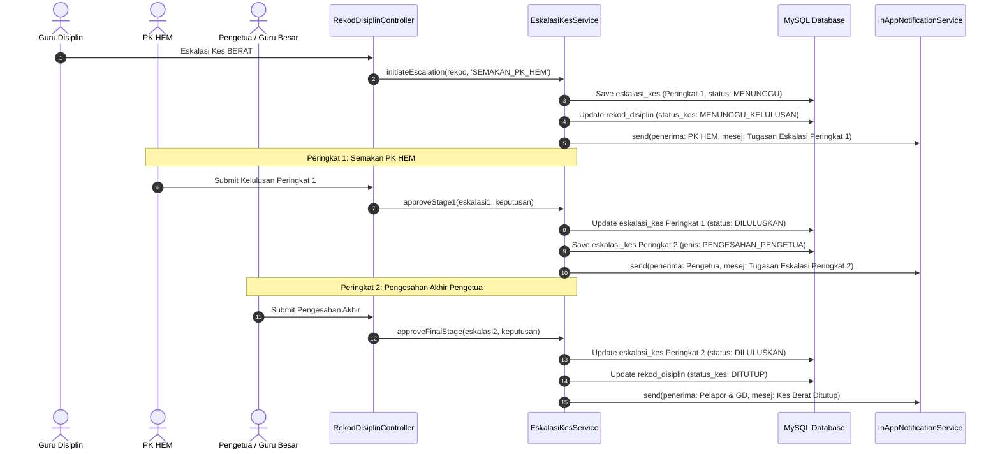
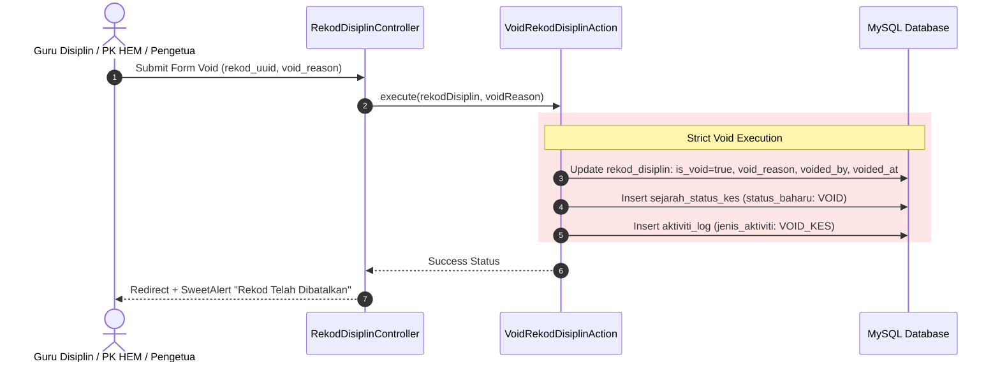

# 12 - UML Diagrams Specification

## 1. Pengenalan
Dokumen UML Diagrams ini menggambarkan struktur interaksi sistem e-Disiplin melalui Use Case Diagram dan Sequence Diagram (Dikemaskini Fasa 2.1).

## 2. Use Case Diagram (Notasi Mermaid)

## 3. Sequence Diagram: Sequential Escalation Kes BERAT (`eskalasi_kes`)

## 4. Sequence Diagram: Pembatalan Kes Rasmi (Void Workflow)

